# Auth & Data Flow Architecture

This document shows how authentication and data flows through the UE5 Question Generator.

## Authentication Flow

## Data Flow: Question Lifecycle

## Firestore Data Model

## Security Rules Summary

## Protected vs Editable Fields

| Category             | Fields                                | Who Can Edit           |
| -------------------- | ------------------------------------- | ---------------------- |
| **🔒 Protected**     | `creatorId`, `uniqueId`, `dateAdded`  | Nobody (immutable)     |
| **👤 Owner Only**    | `creatorEmail`, `creatorName`         | Document owner         |
| **👥 Collaborative** | `status`, `critique`, `humanVerified` | Any authenticated user |
| **📝 Content**       | `question`, `options`, `correct`      | Any authenticated user |

---

## 📊 Data Usage & Privacy

### What Data We Collect

| Data Type             | Source              | Storage                  | Purpose                  |
| --------------------- | ------------------- | ------------------------ | ------------------------ |
| **Email**             | Google OAuth        | Firestore                | User identification      |
| **Display Name**      | Google Profile      | Firestore                | Attribution on questions |
| **Firebase UID**      | Firebase Auth       | Firestore                | Link questions to user   |
| **Question Content**  | User-generated + AI | Firestore + localStorage | Core app functionality   |
| **API Usage Metrics** | Cloud Functions     | Firestore                | Rate limiting, analytics |

### How We Use Your Data

```mermaid
flowchart LR
    subgraph Collect ["📥 Data Collection"]
        A[Google Sign-In] --> B[Email + Name]
        C[Question Generation] --> D[Content + Metadata]
        E[API Calls] --> F[Token Usage]
    end

    subgraph Use ["⚙️ Data Usage"]
        B --> G[Link questions to you]
        B --> H[Display creator attribution]
        D --> I[Store in your question bank]
        D --> J[Export to Google Sheets]
        F --> K[Enforce rate limits]
    end

    subgraph NotUsed ["🚫 NOT Used For"]
        L[❌ Advertising]
        M[❌ Selling to third parties]
        N[❌ Training AI models]
        O[❌ Marketing emails]
    end
```

### Data Sharing

| Recipient             | What Data              | Why                               |
| --------------------- | ---------------------- | --------------------------------- |
| **Google Firebase**   | Auth tokens, questions | Database hosting                  |
| **Google Gemini API** | Question prompts       | AI generation                     |
| **Google Sheets**     | Exported questions     | User-initiated export             |
| **Other Users**       | Questions you create   | Collaborative review (if enabled) |

### Data Retention

| Data                    | Retention Period      | How to Delete                      |
| ----------------------- | --------------------- | ---------------------------------- |
| **localStorage**        | Until browser cleared | Settings → Clear Local Data        |
| **Firestore Questions** | Indefinitely          | Delete individual or Factory Reset |
| **Firebase Auth**       | Until account deleted | Google Account settings            |

### Your Rights

- ✅ **Access** - Export all your questions anytime
- ✅ **Delete** - Remove questions or entire account
- ✅ **Portability** - Export to CSV, JSON, or Google Sheets
- ✅ **Opt-out** - Use without Google Sign-In (limited features)

### Security Measures

| Measure                   | Implementation             |
| ------------------------- | -------------------------- |
| **Encryption at Rest**    | AES-256 for localStorage   |
| **Encryption in Transit** | HTTPS/TLS for all requests |
| **Access Control**        | Firestore security rules   |
| **XSS Prevention**        | DOMPurify sanitization     |
| **Authentication**        | OAuth 2.0 via Google       |
