# Auth & Data Flow Architecture

This document shows how authentication and data flows through the UE5 Question Generator.

## Authentication Flow

## Data Flow: Question Lifecycle

```mermaid
flowchart TB
    subgraph Client ["📱 React Client"]
        A[User Clicks Generate] --> B[useGeneration.js]
        B --> C{Authenticated?}
        C -->|Yes| D[geminiSecure.js]
        C -->|No| E[gemini.js Direct API]
    end

    subgraph CloudFunctions ["☁️ Firebase Cloud Functions"]
        D --> F[generateQuestions]
        F --> G[Rate Limiter Check]
        G --> H[Gemini API Call]
        H --> I[Parse Response]
        I --> J[Return Questions]
    end

    subgraph DataStorage ["💾 Data Storage"]
        J --> K[useQuestionManager.js]
        K --> L[localStorage\nAES Encrypted]
        K --> M[Firestore\nquestions collection]
        M --> N[Security Rules]
    end

    N -->|creatorId == uid| O[✅ Allow]
    N -->|creatorId != uid| P[❌ Deny Write]
```

## Firestore Data Model

## Security Rules Summary

## Protected vs Editable Fields

| Category             | Fields                                | Who Can Edit           |
| -------------------- | ------------------------------------- | ---------------------- |
| **🔒 Protected**     | `creatorId`, `uniqueId`, `dateAdded`  | Nobody (immutable)     |
| **👤 Owner Only**    | `creatorEmail`, `creatorName`         | Document owner         |
| **👥 Collaborative** | `status`, `critique`, `humanVerified` | Any authenticated user |
| **📝 Content**       | `question`, `options`, `correct`      | Any authenticated user |
